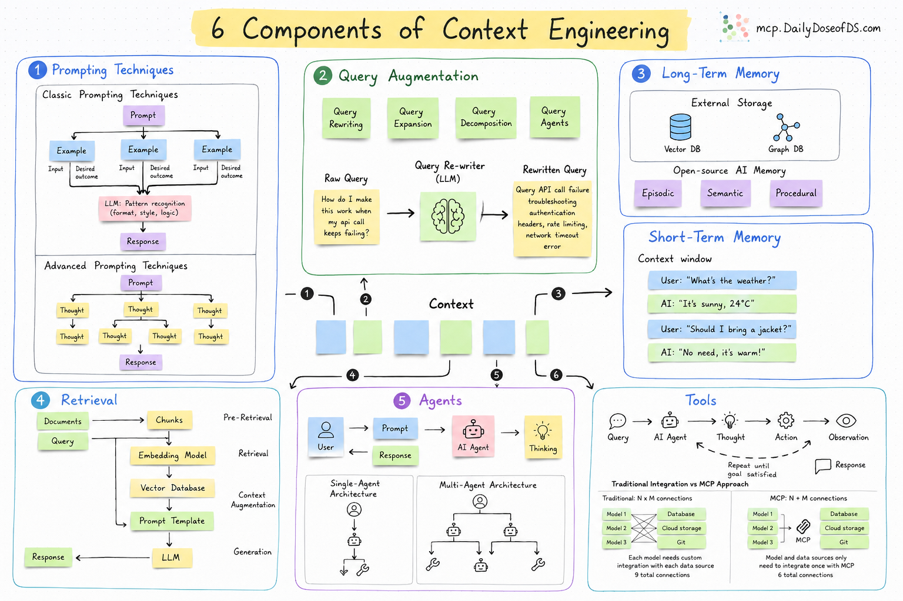

# Context Engineering with [Pixeltable](https://pixeltable.com/)

This project demonstrates **Context Engineering**—a sophisticated approach to building AI systems that intelligently manage and utilize context from multiple sources. The demo showcases how to combine Retrieval Augmented Generation (RAG), tool calling, and advanced memory management to create context-aware AI agents that can answer questions accurately using both external knowledge and conversation history.



How It Works:

1.  **Document Ingestion**: Financial documents are loaded into a Pixeltable database and automatically chunked for efficient retrieval.
2.  **RAG Setup**: Documents are embedded using sentence transformers and indexed for semantic search, enabling the system to find relevant information from PDFs.
3.  **Tool Integration**: Custom tools are created for document search (RAG) and external APIs (MCP servers), extending the agent's capabilities beyond text generation.
4.  **Agent Creation**: An AI agent is configured with these tools and a system prompt that guides its behavior for context-aware responses.
5.  **Memory Management**: The system implements both short-term memory (conversation history) and long-term memory (vector database) for persistent, searchable context.
6.  **Context Engineering**: Multiple context sources (tool outputs, chat history, long-term memory) are intelligently combined and summarized to stay within token budgets.
7.  **Response Generation**: A specialized response agent synthesizes all context sources into accurate, helpful answers while respecting a hierarchy of information sources.

We use:

- [Pixeltable](https://docs.pixeltable.com) for AI data infrastructure
- [Pixelagent](https://github.com/pixeltable/pixelagent) for stateful agents

## Set Up

Follow these steps one by one:

### Install Dependencies

```bash
uv sync
```
